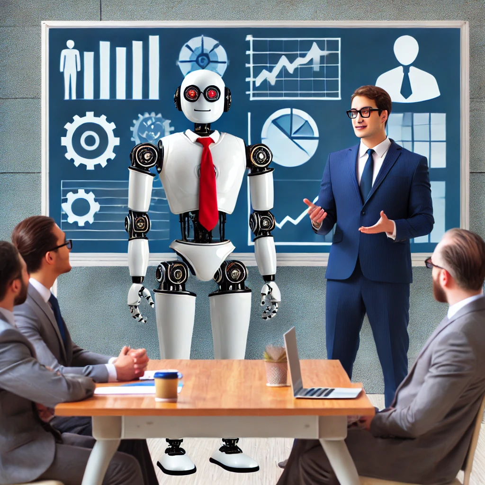
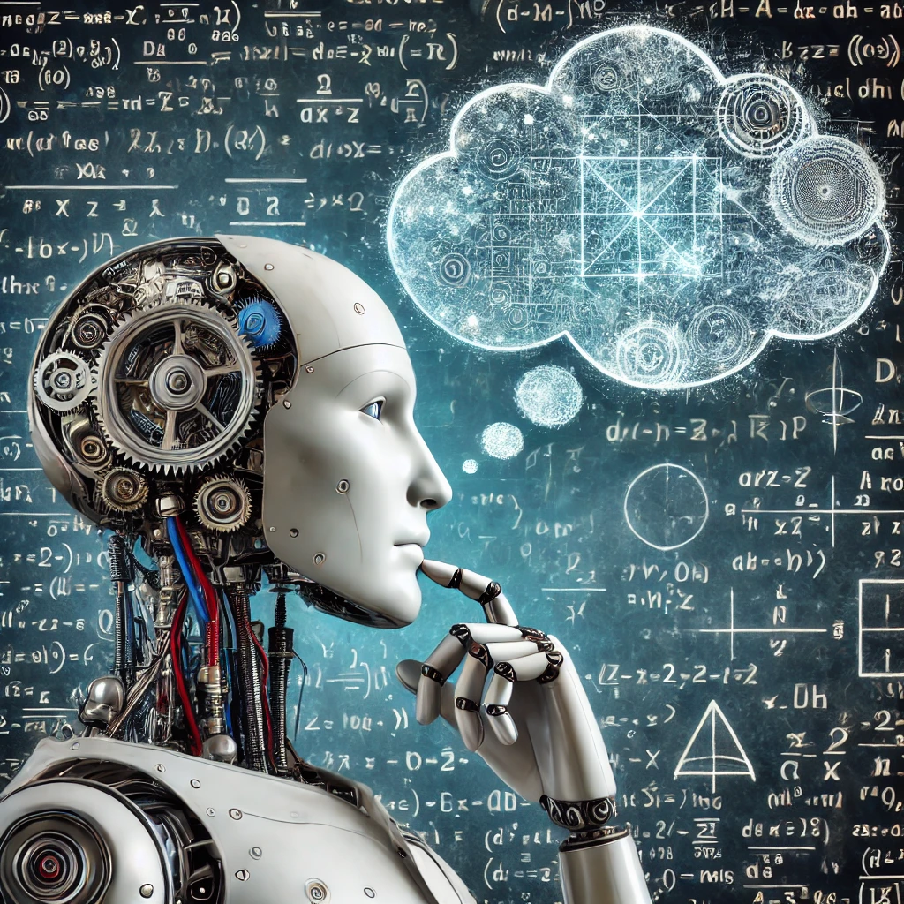

# Using AI for Software Development

## Slide 1: Introduction
### Title: Using AI for Software Development
**Content:**
- Purpose: Introduce AI integration in software development.
- Overview: AI, including machine learning and deep learning.

{: style="width: 70%; height: auto;"}

Note: Welcome everyone to the presentation. Briefly introduce the topic of AI in software development. Explain what AI is, focusing on machine learning and deep learning. Mention the growing importance of AI in the tech industry.

---

## Slide 2: Historical Context
### Title: Evolution of AI in Software Development
**Content:**
- Early Uses: Trace the evolution of AI in software engineering.
- Milestones: Key breakthroughs in automated code generation and bug fixing.

."){: style="width: 70%; height: auto;"}

Note: Discuss the initial uses of AI in software development, such as simple automation tools. Highlight significant milestones, like the development of AI for code generation and debugging. Emphasize the progression from simple tools to advanced AI systems.

---

## Slide 3: Current Applications
### Title: AI in Today's Software Development
**Content:**
- AI-Assisted Coding: GitHub Copilot.
- Automated Testing and Debugging: AI for bug detection and tests.
- Code Review and Optimisation: AI analyzing code for inefficiencies.
- Project Management: AI in task prediction and deadline management.

{: style="width: 70%; height: auto;"}

Note: Introduce current AI tools like GitHub Copilot that assist in coding. Explain how AI can automate testing and debugging, saving developers time. Discuss AI's role in code review and optimization. Highlight the use of AI in project management for predicting tasks and managing deadlines.

---

## Slide 4: Benefits of AI in Software Development
### Title: Advantages of AI
**Content:**
- Increased Efficiency: Faster coding and debugging.
- Reduced Errors: Early error detection and correction.
- Personalised Assistance: Tailored support based on coding styles.

{: style="width: 70%; height: auto;"}

Note: Explain how AI increases efficiency by speeding up coding and debugging processes. Discuss the reduction in errors due to early detection and correction by AI. Highlight the personalized assistance provided by AI tools, which adapt to individual coding styles.

---

## Slide 5: Challenges and Limitations
### Title: Challenges of AI
**Content:**
- Accuracy and Reliability: Understanding complex human logic.
- Ethical Concerns: Potential job displacement.
- Dependence on Data Quality: Importance of clean datasets.

{: style="width: 70%; height: auto;"}

Note: Address the limitations of AI in understanding complex human logic and creativity. Discuss ethical concerns, such as the potential for AI to displace jobs. Emphasize the importance of high-quality data for training effective AI models.

---

## Slide 6: Personal Research Insights
### Title: Real-World AI Integration
**Content:**
- First User Story Experiment: Testing AI on a simple user story.
- Retro Style Demo Project: Reinforcing findings with a safe project.

{: style="width: 70%; height: auto;"}

Note: Share personal experiences using AI in a real-world user story. Describe the retro-style demo project and how it helped reinforce initial findings. Highlight the pros and cons discovered during these experiments.

---

## Slide 7: Context Window Issue
### Title: The Context Window Challenge
**Content:**
- Explanation: Limited memory of AI models.
- Impact: Loss of relevant information over time.
- Solution Attempts: Re-feeding previous decisions into the AI.

{: style="width: 70%; height: auto;"}

Note: Explain the concept of the context window and its limitations in AI models. Discuss the impact of losing relevant information as the context window progresses. Describe attempts to mitigate this issue by re-feeding previous decisions and code snippets.

## Slide 8: In-House AI Deployment Challenges
### Title: Implementing AI In-House
**Content:**
- Need for Offline Solutions: Security and compliance issues.
- Current Tools and Their Limitations: Internet dependence.
- Azure-hosted ChatGPT: Development requirements.
- Local Deployment Challenges: Hardware needs and model management.

{: style="width: 70%; height: auto;"}

Note: Discuss the need for offline AI solutions to meet security and compliance requirements. Highlight the limitations of current AI tools that require internet access. Explain the development requirements for Azure-hosted ChatGPT and its limitations. Address the challenges of deploying AI locally, including hardware needs and model management.

---

## Slide 9: Proposed Solutions for In-House AI Tools
### Title: Overcoming Deployment Challenges
**Content:**
- Server-Hosted Systems: Centralized AI model management.
- Specialised Software Agents/Clients: Efficient data exchange.

{: style="width: 70%; height: auto;"}

Note: Propose server-hosted AI systems to centralize model management and reduce hardware requirements. Suggest developing specialized software agents or clients for efficient and secure data exchange with the AI server.

---

## Slide 10: Practical Applications and Benefits
### Title: AI's Practical Benefits
**Content:**
- Automated Documentation: Consistency and completeness.
- Code Analysis and Feedback: Constructive optimization suggestions.
- Enhanced Problem Solving: Introducing novel solutions.
- Rapid Prototyping: Speeding up initial stages of development.
- Support Throughout SDLC: Planning, design, testing, and maintenance.

{: style="width: 70%; height: auto;"}

Note: Highlight the practical benefits of AI in automating documentation. Discuss how AI can provide constructive feedback and optimization suggestions for code. Explain how AI can enhance problem-solving by introducing novel solutions. Emphasize the role of AI in rapid prototyping and support throughout the software development lifecycle.

---

## Slide 11: Conclusion
### Title: Harnessing AI's Potential
**Content:**
- Acknowledging Limitations: Understanding current limitations.
- Future Potential: Pushing for more accessible and effective AI tools.

{: style="width: 70%; height: auto;"}

Note: Summarize the key points discussed in the presentation. Emphasize the importance of understanding current limitations while harnessing AI's potential for future improvements. Encourage the audience to consider the benefits and challenges of integrating AI into their own workflows.

---

## Slide 12: Personal Insights and Takeaways
### Title: Lessons Learned
**Content:**
- Learning Curve: Continuous adjustment and feedback.
- Future Applications: Shaping views on AI roles in software development.

{: style="width: 70%; height: auto;"}

Note: Share personal insights and lessons learned from using AI. Discuss the continuous adjustment and feedback required when working with AI tools. Reflect on future applications and potential roles of AI in the software development industry.

---

## Slide 13: Q&A
### Title: Questions and Answers
**Content:**
- Open the floor for questions and audience engagement.

{: style="width: 70%; height: auto;"}

Note: Encourage the audience to ask questions and engage in discussion. Be prepared to address any concerns or queries regarding AI in software development. Thank the audience for their attention and participation.

---

## Slide 14: Surprise!
### Title: Surprise!
**Content:**
- Reveal: The entire presentation was AI-generated.
- Purpose: Demonstrate AI's capabilities in creating comprehensive content.

{: style="width: 70%; height: auto;"}

Note: Reveal to the audience that the entire presentation was created using AI. Highlight the ease and efficiency of using AI for generating professional presentations. Discuss any reactions or feedback from the audience regarding the quality and effectiveness of the AI-generated content.